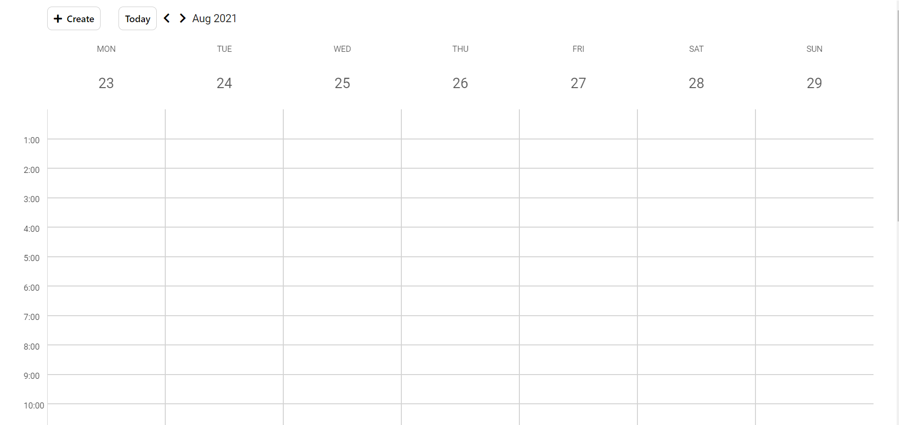

# 📅 Calendar app

## [App link](https://art-litv.github.io/calendar)

## 🗃️ Project structure

### 💡 scripts

- contains all app logic, including rendering most of the HTML components and reacting to user's actions

### 💅 styles

- contains all app styles (scss)

### 📁 main directory

- contains configuration files, compiled styles and images

### ➡️ To start:

1. clone the repo
2. install LTS [NodeJS](https://nodejs.org/en/) (if not installed)
3. run `npm install` to to use eslint in the project
